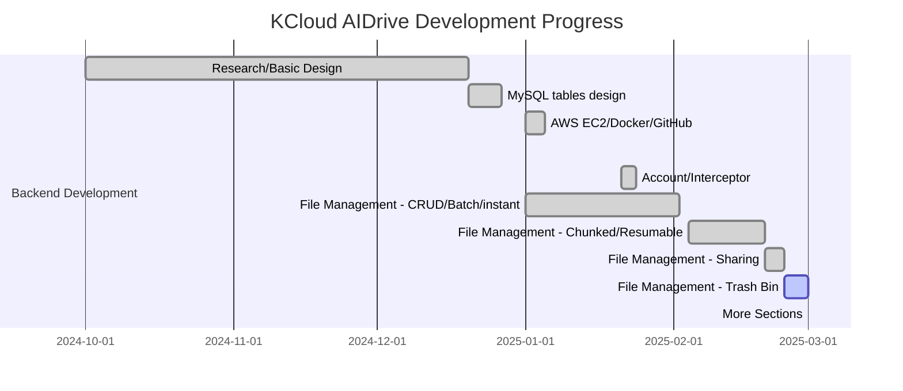
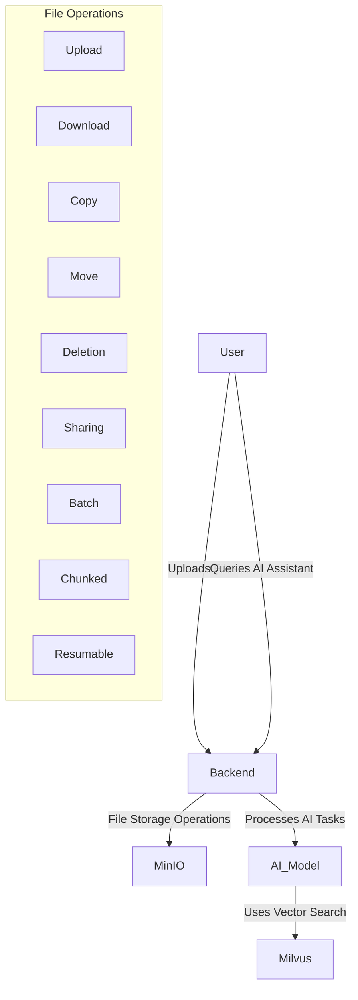

# 🚀 KCloud AIDrive: AI-Powered Intelligent Cloud Storage

## 📌 Table of Contents
- [Introduction](#introduction)
- [Project Status](#-project-status)
- [Project Progress Tracking](#-project-progress-tracking)
- [Core Technology Stack](#core-technology-stack)
- [Key Features](#key-features)
- [Feature Comparison](#feature-comparison)
- [System Architecture](#system-architecture)
- [API Documentation](#api-documentation)
- [Contact & Support](#-contact--support)

---

## 🚀 Introduction

**KCloud AIDrive** is an AI-powered intelligent cloud storage system that integrates intelligent large file management with advanced LLM AI models. This project is designed for personal learning and study, enabling AI-enhanced file search, intelligent categorization, and smart automation. It serves as a hands-on exploration of cloud storage solution and AI-drive automation, combining backend development with modern AI frameworks. 

---

## 📌 Project Status
🚧 **Under Active Development** 🚧  
This project is currently in active development. New features, optimizations, and AI integrations are continuously being added. Stay tuned for updates!

### 🚀 Project Progress Tracking


---

## 🔧 Core Technology Stack
| Technology                       | Stack Used                                                                                                                                             |
|----------------------------------|--------------------------------------------------------------------------------------------------------------------------------------------------------|
| **Backend**                      | Spring Boot 3.x, JDK 21, Java Ecosystem Libraries (JPA, Redis, Kafka)                                                                                  |
| **AI Integration**               | Python 3.x, FastAPI, LangChain, Milvus                                                                                                                 |
| **Cloud Storage**                | MinIO, AWS S3 SDK Java 2.X, Distributed File Systems, Large File Transfer Processing (Chunked Upload, Instant Transfer/Upload, Resumable Upload, etc.) |
| **Database**                     | MySQL, Vector DB (Milvus)                                                                                                                              |
| **LLM Models**                   | GPT-4, ChatGLM, LLaMA                                                                                                                                  |
| **Security**                     | JWT, OAuth2, Spring Security                                                                                                                           |
| **Deployment & DevOps**          | Docker, Docker Compose, AWS EC2, Kubernetes, Spring Cloud, CI/CD (Jenkins, GitHub Actions)                                                             |

---

# 🚀 Key Features

## 📂 Intelligent Cloud Storage & File Management
- Supports multiple **file types** and **storage architectures** similar to **Alibaba Cloud Drive, Baidu Cloud, and NAS**.
- Efficient **large file handling**, including:
    - **Chunked uploads** (split large files for optimized transfers).
    - **Instant transfer** (deduplication for quick uploads).
    - **Resumable uploads** (continue uploads after interruptions).
- Integration with **distributed file systems** to ensure **scalability and reliability**.

## 🤖 AI-Powered Assistants & Automation
- **AI Chat Assistant**:
    - Acts as a **long-term memory personal assistant**.
    - Functions as an **intelligent customer service agent**.
    - Can serve as an **AI-driven sales consultant**.
- **Enterprise Q&A Knowledge Base**:
    - **Knowledge retrieval-based Q&A** with custom document uploads.
    - **URL parsing** and **real-time internet search** for dynamic knowledge access.
- **Document AI Assistant**:
    - **Summarization** of long documents into concise key points.
    - **Structured content analysis** for better organization.
    - **AIGC-powered marketing content generation**.

## 🛠 Full-Stack + AI + Cloud Development Practice
- **From 0 to 1**:
    - A **complete practice** to **LLM AI fundamentals** and **hands-on project implementation**.
- **Designed for developers**:
    - Expand **front-end & back-end** expertise with **AI integration**.
- **Cloud-native deployment**:
    - Built on **AWS EC2** with **Docker and Kubernetes** for scalable cloud solutions.

---

## 🌐 Feature Comparison
| Feature               | KCloud AIDrive   | Traditional Cloud Storage |
|----------------------|------------------|--------------------------|
| **AI-Powered Search** | ✅ Yes            | ❌ No |
| **Large File Handling** | ✅ Optimized      | ⚠️ Limited |
| **Smart Categorization** | ✅ AI-Based       | ❌ Manual Sorting |
| **Multi-Storage Support** | ✅ S3, MinIO      | ❌ Cloud Only |
| **LLM Model Integration** | ✅ Yes            | ❌ No |
| **Hybrid AI Chatbot** | ✅ Yes            | ❌ No |

---

## 🔄 System Architecture


---

## 📘 API Documentation
You can generate API docs using **Swagger OpenAPI** (after project finishing development):
```sh
curl -o openapi.json http://localhost:8080/v3/api-docs
```

---


## 🌎 Contact & Support
For questions, suggestions, or issues, please contact me directly.

📩 **Email:** kaikangsde@gamil.com  
🐙 **GitHub:** (https://github.com/kaikang-sde/kcloud_aidrive)  
🔗 **LinkedIn:** (https://www.linkedin.com/in/kaikangsde/)

